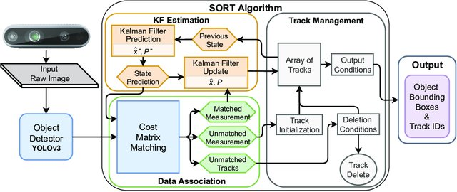
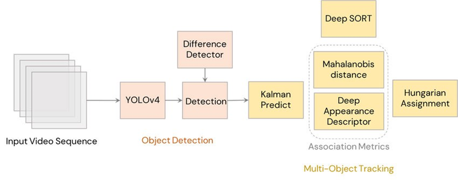

# Evaluation of Object Tracking Methods for Edge Devices (Raspberry pi)

## Experiment I: Testing Object Trackers
In this experiment, Eight known object tracking algorithms were tested on both PC and RASP to evaluate their performance regarding tracking accuracy and time efficiency.

Eight different trackers were tested on a sample video.
This video includes a scene of road intersection with vehicles and perestrians. 
The test is done by tracking a pedestrian (bounding box previously extracted by manual selection).

### Boosting Tracker
The Boosting Tracker is based on the AdaBoost algorithm. This algorithm adjusts the weights of objects that are misclassified, enabling a less robust classifier to concentrate on identifying them. As the classifier undergoes “online” training, the user identifies the frame containing the object to be tracked. Initially, this object is considered a correct detection, while the surrounding objects are deemed background.
Upon receiving a new frame, the classifier evaluates the detection pixels around the object from the previous frame, and the object’s new location is determined by the area with the highest score.

**Pros**: The tracker is quite precise in following the object, despite the algorithm being considered outdated.

**Cons**: The tracking speed is relatively slow, it’s highly sensitive to noise and obstructions, and it lacks the capability to cease tracking once the object goes missing.

Device|pc | rasp
:-:|:-: | :-:
Output Video|  | 
Average FPS | 37.8 | 17.6

### MIL (Multiple Instance Learning) Tracker
MIL Tracker has the same approach as BOOSTING, however, instead of guessing where the tracked object is in the next frame, an approach is used in which several potentially positive objects, called a “bag”, are selected around a positive definite object. A positive “bag” contains at least one positive result.

**Pros**: more robust to noise, shows fairly good accuracy.

**Cons**: relatively low speed and the impossibility of stopping tracking when the object is lost.

Device|pc | rasp
:-:|:-: | :-:
Output Video|  | 
Average FPS | 12.4 | 6.8

### KCF (Kernelized Correlation Filters) Tracker
KCF Tracker is a combination of two algorithms: BOOSTING and MIL. The concept of the method is that a set of images from a “bag” obtained by the MIL method has many overlapping areas. Correlation filtering applied to these areas makes it possible to track the movement of an object with high accuracy and to predict its further position.

**Pros**: sufficiently high speed and accuracy, stops tracking when the tracked object is lost.

**Cons**: inability to continue tracking after the loss of the object.

Device|pc | rasp
:-:|:-: | :-:
Output Video|  | 
Average FPS | N | N

### TLD (Tracking Learning Detection) Tracker
TLD Tracker allows you to decompose the task of tracking an object into three processes: tracking, learning and detecting. The tracker (based on the MedianFlow tracker) tracks the object, while the detector localizes external signs and corrects the tracker if necessary. The learning part evaluates detection errors and prevents them in the future by recognizing missed or false detections.

**Pros**: shows relatively good results in terms of resistance to object scaling and overlapping by other objects.

**Cons**: rather unpredictable behavior, there is the instability of detection and tracking, constant loss of an object, tracking similar objects instead of the selected one.

Device|pc | rasp
:-:|:-: | :-:
Output Video|  | 
Average FPS | 18 | 8.4

### Median Flow Tracker
Median Tracker is based on the Lucas-Kanade method. The algorithm tracks the movement of the object in the forward and backward directions in time and estimates the error of these trajectories, which allows the tracker to predict the further position of the object in real-time.

**Pros**: sufficiently high speed and tracking accuracy, if the object isn’t overlapped by other objects and the speed of its movement is not too high. The algorithm quite accurately determines the loss of the object.

**Cons**: high probability of object loss at high speed of its movement.

Device|pc | rasp
:-:|:-: | :-:
Output Video|  | 
Average FPS | N | N

### GOTURN (Generic Object Tracking Using Regression Network) Tracker
GOTURN Tracker algorithm is an “offline” tracker since it basically contains a deep convolutional neural network. Two images are fed into the network: “previous” and “current”. In the “previous” image, the position of the object is known, while in the “current” image, the position of the object must be predicted. Thus, both images are passed through a convolutional neural network, the output of which is a set of 4 points representing the coordinates of the predicted bounding box containing the object. Since the algorithm is based on the use of a neural network, the user needs to download and specify the model and weight files for further tracking of the object.

**Pros**: comparatively good resistance to noise and obstructions.

**Cons**: the accuracy of tracking objects depends on the data on which the model was trained, which means that the algorithm may poorly track some objects selected by the user. Loses an object and shifts to another if the speed of the first one is too high.

Device|pc | rasp
:-:|:-: | :-:
Output Video|  | 
Average FPS | 20 | 1.9

### MOSSE Tracker
MOSSE Tracker is based on the calculation of adaptive correlations in Fourier space. The filter minimizes the sum of squared errors between the actual correlation output and the predicted correlation output. This tracker is robust to changes in lighting, scale, pose, and non-rigid deformations of the object.

**Pros**: very high tracking speed, more successful in continuing tracking the object if it was lost.

**Cons**: high likelihood of continuing tracking if the subject is lost and does not appear in the frame.

Device|pc | rasp
:-:|:-: | :-:
Output Video|  | 
Average FPS | N | N

### CSRT Tracker
CSRT (Channel and Spatial Reliability Tracking) Tracker uses spatial reliability maps for adjusting the filter support to the part of the selected region from the frame for tracking, which gives an ability to increase the search area and track non-rectangular objects. Reliability indices reflect the quality of the studied filters by channel and are used as weights for localization. Thus, using HoGs and Colornames as feature sets, the algorithm performs relatively well.

**Pros**: among the previous algorithms it shows comparatively better accuracy, resistance to overlapping by other objects.

**Cons**: sufficiently low speed, an unstable operation when the object is lost.

Device|pc | rasp
:-:|:-: | :-:
Output Video|  | 
Average FPS | 58.8 | 19.4

## Experiment II: Testing SORT Method

The SORT (Simple Online and Realtime Tracking) algorithm is a real-time effective tracking algorithm. It combines the concepts of Kalman filters and Hungarian algorithms to track objects.

Detection: The SORT algorithm starts by using a detection algorithm, such as a deep learning-based object detector, to identify objects in the first frame of the video sequence. Each detected object is assigned a unique identification number.

Estimation: The detections from the current frame are propagated to the next frame by estimating the position of objects using a constant velocity model. These velocity components are solved by the Kalman filter.

Data Association: After the estimation of future frames the IOU of ground truth and the estimation are taken and if the IOU is less than the threshold then predictions are rejected.

State Update: Once the associations are established, the SORT algorithm updates the state of each tracked object by incorporating the newly detected information. This includes updating the object’s position, velocity, and other relevant attributes.

pc | rasp
:-: | :-:
 | 

## Expermint III: Testing DeepSORT Method

DeepSORT (Deep Learning-based SORT) is an extension of the popular object tracking algorithm called SORT (Simple Online and Realtime Tracking). DeepSORT adds deep appearance feature extraction and a matching process to the original SORT algorithm to improve its tracking accuracy and robustness.
The architecture of DeepSORT can be broken down into the following steps:
1.	Detection: Use an object detection algorithm (such as YOLO) to detect objects in each frame of a video.
2.	Feature extraction: Extract a deep appearance feature vector for each detected object using a CNN-based feature extractor (such as ResNet).
3.	Data association: Associate the detected objects across frames using a matching algorithm (such as the Hungarian algorithm) that takes into account both the location and appearance of the objects.
4.	Track management: Manage the tracks by updating the state of each track (i.e., position and velocity) based on the associated objects and their appearance features.
5.	Track pruning: Remove tracks that have not been associated with any objects for a certain number of frames or that have low confidence scores.
The deep appearance features used in DeepSORT are learned during training from a large dataset of object images. By incorporating appearance features in addition to the location and motion information used by the original SORT algorithm, DeepSORT is able to handle situations where objects may temporarily disappear or occlude each other, leading to more accurate and robust object tracking.

pc | rasp
:-: | :-:
 | 
